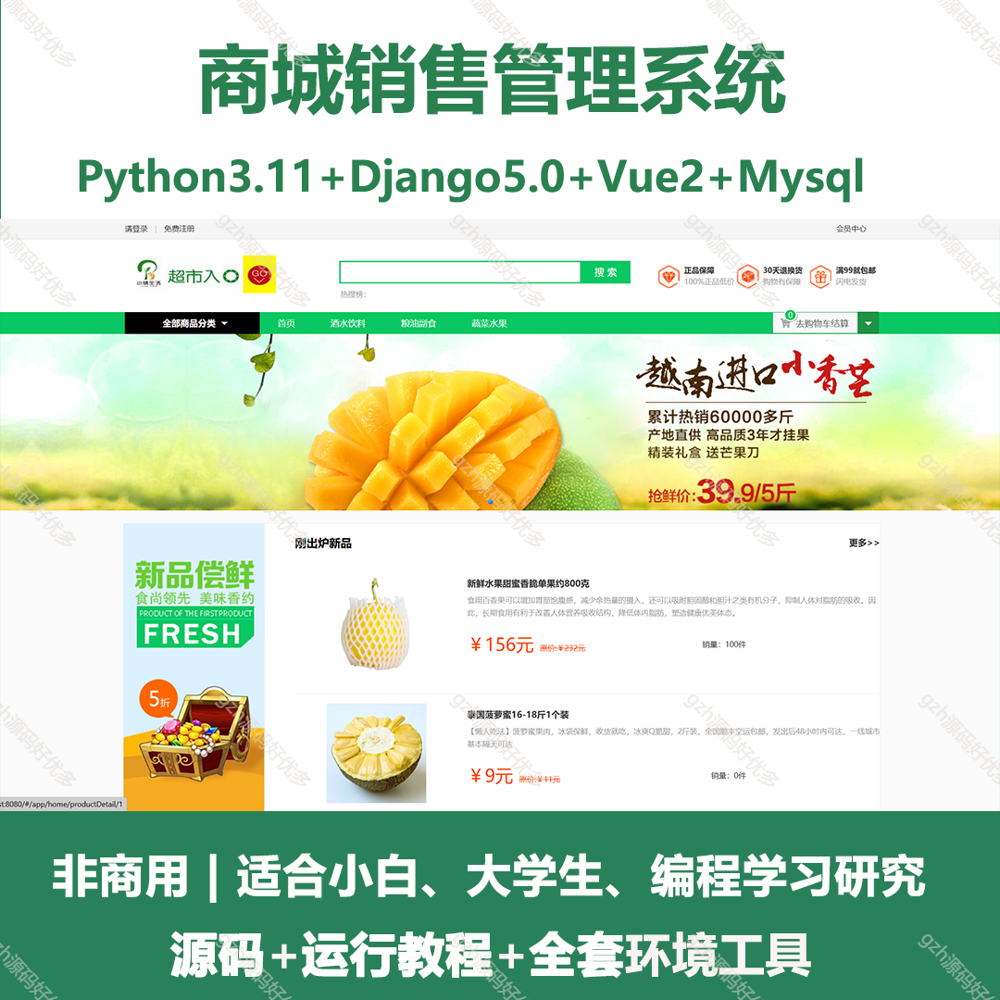
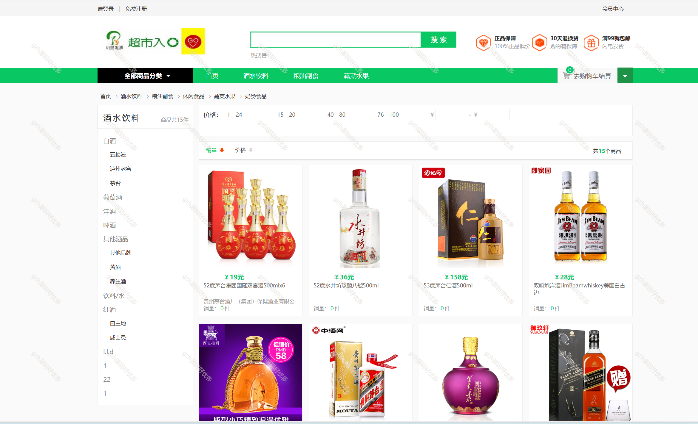
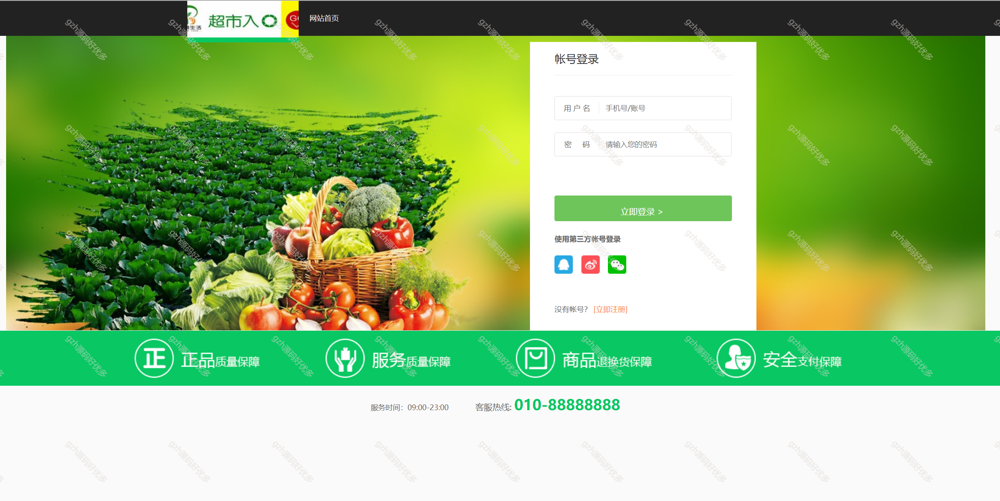
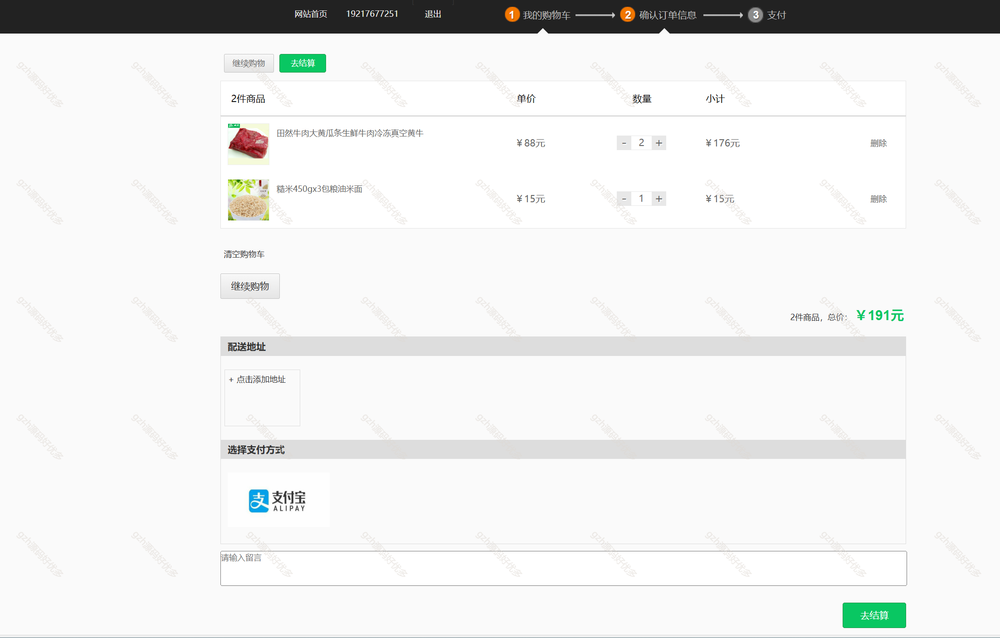
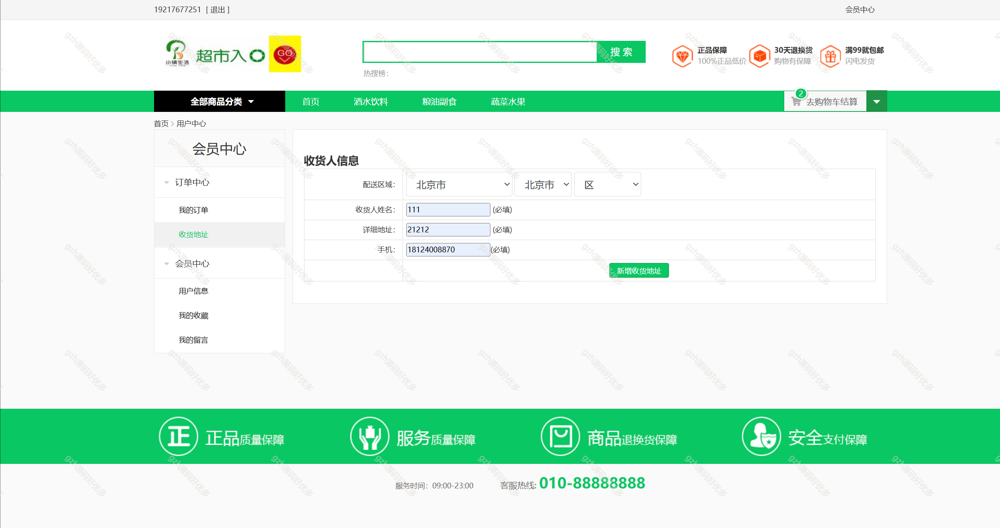
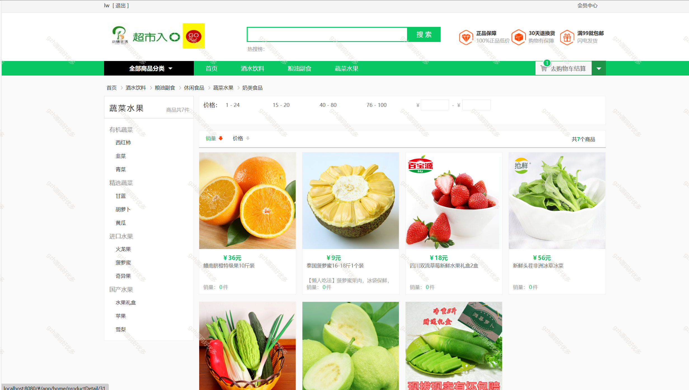
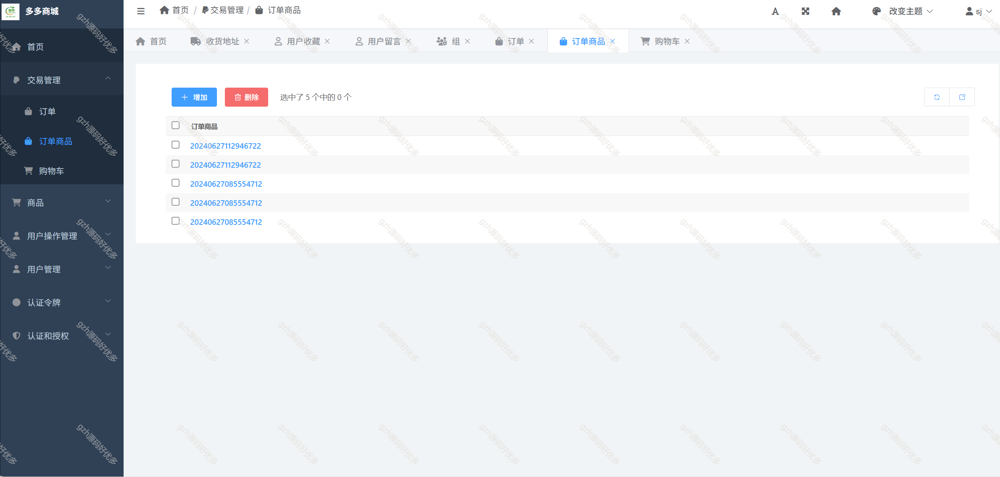
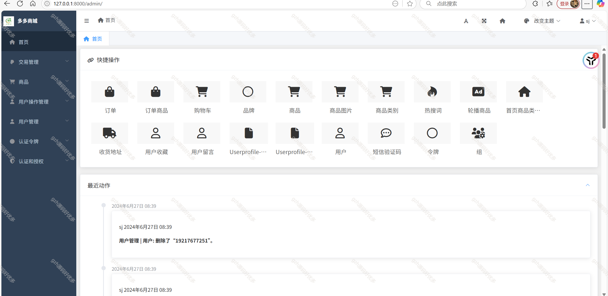
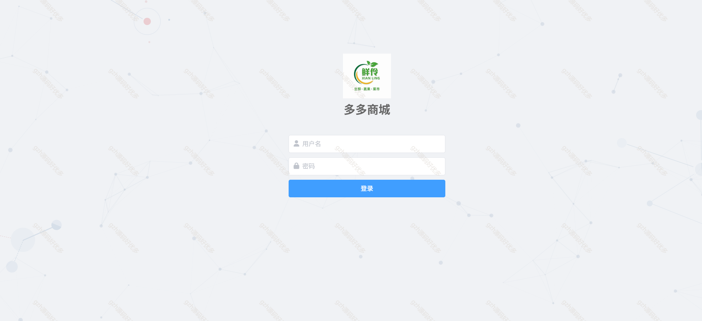

# python041
python041基于Python+Django的生鲜水果商城销售系统
 
## 查看主页获取源码

### 一、关键词

购物商城系统、水果商城销售系统

 

### 二、作品包含

源码+数据库+全套环境和工具资源+部署教程

 

### 三、项目技术

前端技术：vue+Element UI + Axios
管理端：系统使用django自带的admin管理后台，使用simpleUI库进行进行美化，基本具有所有数据的管理功能！（原自Django强大的admin管理后台）
后端技术：Python3.11、Django5.0
  

 

### 四、运行环境（以下版本亲测，其他版本未知，请自测）

开发工具：PyCharm 

数据库：MySQL8

数据库管理工具：Navicat10+

Python3.11

浏览器：谷歌浏览器

 

### 五、项目介绍

项目编号：python041

购物商城系统为商家与用户搭建线上交易平台，支持商品展示、选购，具备订单处理、库存管理、用户信息及营销推广等功能，实现购物流程数字化与商城运营高效化 。

功能介绍：
客户端：登录/注册
首页：展示热销商品，推荐商品
搜索：根据关键词进行商品搜索
商品详情：显示商品图片，详细描述、价格等信息
订单结算：通过购物车加入进行订单结算
订单中心：用户可以查看自己所有订单状态，包括订单详情、订单历史等
收货地址：用户可以添加、修改、删除自己设置的收货地址
用户收藏：用户将商品添加到收藏夹，也可删除收藏夹内的商品
用户反馈：用户可以进行投诉，反馈

 

### 六、运行截图

